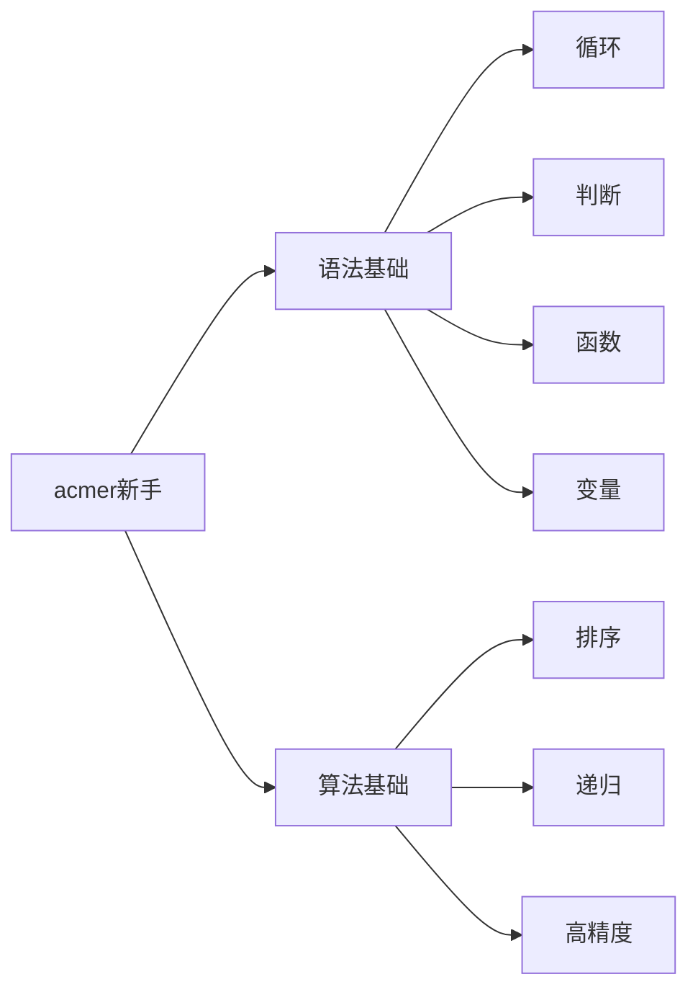
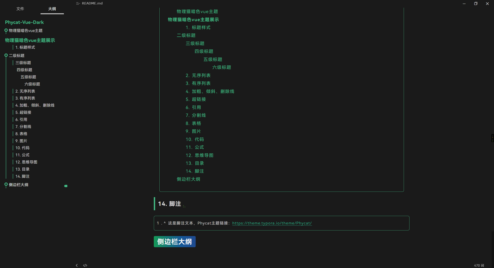
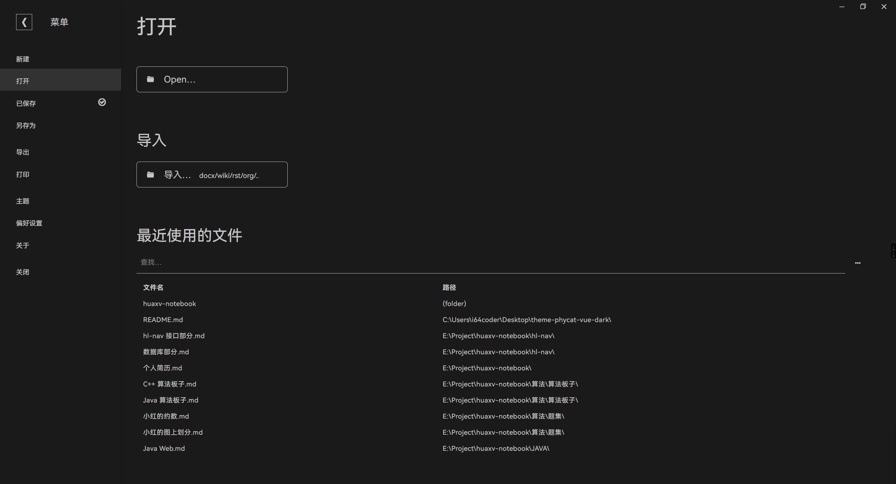

# Phycat-Vue-Dark

> 此主题仅在 Windows 下设计和测试，其他操作系统上的效果未知！

## 物理猫暗色vue主题

---

# 物理猫暗色vue主题展示

### 1. 标题样式

## 二级标题

### 三级标题

#### 四级标题

##### 五级标题

###### 六级标题

### 2. 无序列表

- 无序单元1
- 无序单元2
- 无序单元3

### 3. 有序列表

1. 有序单元1
2. 有序单元2
3. 有序单元3

### 4. 加粗、倾斜、删除线

**这是加粗文本**

*这是倾斜文本*

==高亮文本==

<u>下划线</u>

~~删除线~~

### 5. 超链接

超链接签名会有一个小图标

https://vuejs.org/

[vue](https://vuejs.org/)

### 6. 引用

>集中一点，登峰造极！

### 7. 分割线

分割线以上的内容

---

分割线以下的内容

### 8. 表格

| 姓名       | 性别 | 年龄  |
| :--------- | :--- | :---- |
| 洛琪希     | 女   | 44    |
| 北白川玉子 | 女   | 16~17 |
| 御坂美琴   | 女   | 14    |

### 9. 图片


### 10. 代码

- 行内代码

打印的语法：`print("Hello World!")`

- 代码块

```python
# 九九乘法表
for j in range(1, 10):
  for i in range(1, j + 1):
    print(f'{i}*{j}={i * j}\t', end='')
  print()
```

### 11. 公式

- 行内公式

这是一个行内公式：$\sum_{i=1}^{n} \frac{1}{i^2} = \frac{\pi^2}{6}$

- 块公式

$$
\begin{align*}
\nabla \cdot \mathbf{E} &= \frac{\rho}{\epsilon_0} \\
\nabla \cdot \mathbf{B} &= 0 \\
\nabla \times \mathbf{E} &= -\frac{\partial \mathbf{B}}{\partial t} \\
\nabla \times \mathbf{B} &= \mu_0 \mathbf{J} + \mu_0 \epsilon_0 \frac{\partial \mathbf{E}}{\partial t}
\end{align*}
$$

- 矩阵

$$
\begin{pmatrix}
a_{11} & a_{12} & a_{13} \\
a_{21} & a_{22} & a_{23} \\
a_{31} & a_{32} & a_{33}
\end{pmatrix}
$$

### 12. 思维导图



### 13. 目录

[TOC]

### 14. 脚注

[^1]: 这是脚注文本，Phycat主题链接：https://theme.typora.io/theme/Phycat/

## 侧边栏大纲



## 设置栏菜单

